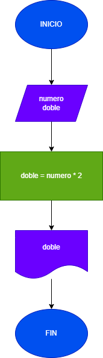
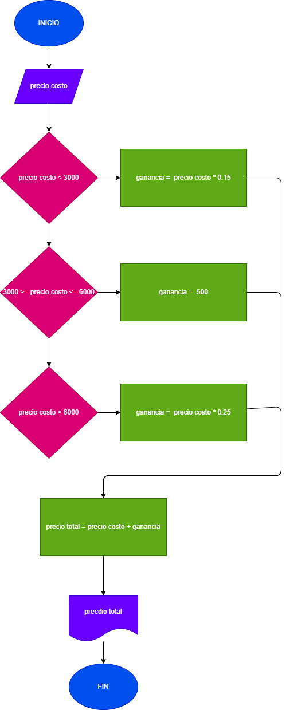
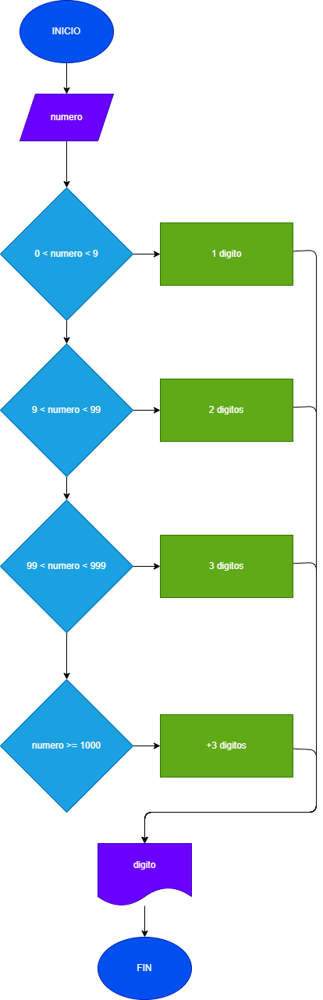
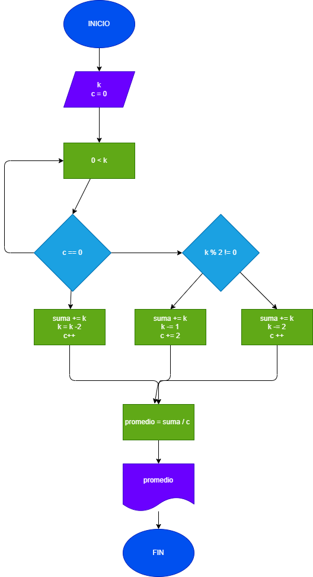
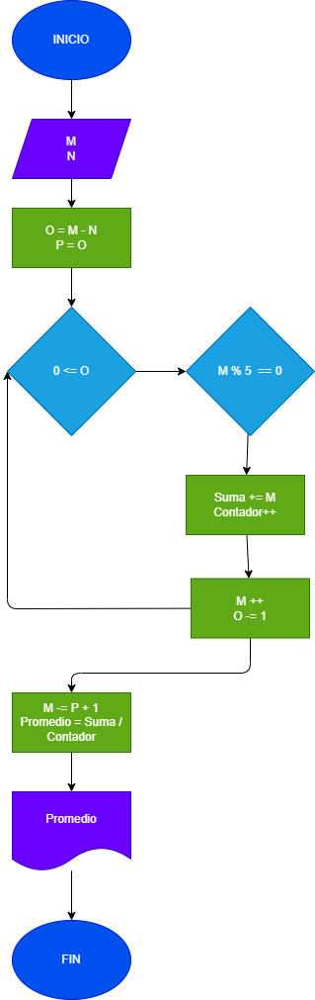
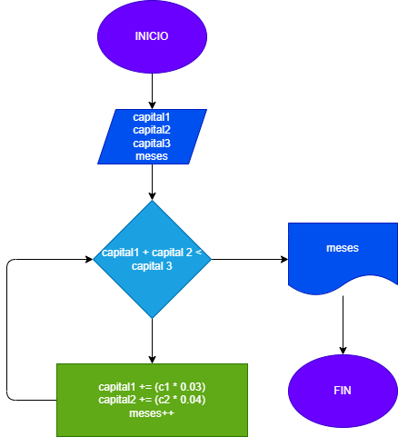

# Elaborar diagrama de flujo y programa en Java para resolver los siguientes problemas:
## Ejercicio No. 1
### Calcular e imprimir el doble de un número X.
## Ejercicio No. 2
### El dueño de una papelería desea un programa que le indique el precio de venta de un artículo dado. El precio se calcula con la siguiente fórmula:
#### P = precioCosto + ganancia
### Donde la ganancia será:
#### -El 15% si el costo es inferior a $3000
#### -$500 si el costo está entre $3000 y $6000
#### -El 25% si el costo supera los $6000.
## Ejercicio No. 3
### Leer un número entero y que determinar si dicho número es de uno, dos o tres dígitos.
## Ejercicio No. 4
### Calcular la suma y el promedio de los números pares menores o iguales que un número K leído al comienzo.
## Ejercicio No. 5
### Leer dos números M y N, luego calcular la suma y el promedio de los múltiplos de 5 que están entre ellos, incluidos M y/o N si es que son múltiplos de 5.
## Ejercicio No. 6
### Pedro tiene capital de C1 pesos y Juan uno de C2 pesos. Uniendo los dos capitales no les alcanza para realizar un negocio que requiere una inversión de C3 pesos. Deciden colocar cada uno su capital a ganar intereses. Pedro lo colocó a un interés compuesto del 3% mensual y Juan al 4% mensual. Hacer un programa que averigüe e imprima en cuántos meses, uniendo los dos capitales, pueden hacer el negocio que desean. (Tomado de Carrillo, Elberto (1995). Introducción a los computadores. Problemario Solucionario. Universidad Industrial de Santander.)
## Ejercicio No. 7
### Hacer un programa que tome uno a uno los elementos enteros de un arreglo unidimensional (vector, array) llamado bases ya inicializado y en un segundo arreglo llamado resultados coloque el cuadrado de cada número del arreglo bases en caso de ser par, o el cubo si es impar
## Ejercicio No. 8
### Leer una matriz M, (arreglo bidimensional) de m filas y n columnas. Los elementos son números enteros aleatorios positivos. Crear e imprimir dos vectores así: el vector A que contenga todos los números pares de la matriz M, y el vector B que contenga los números impares.}

# Diagramas

